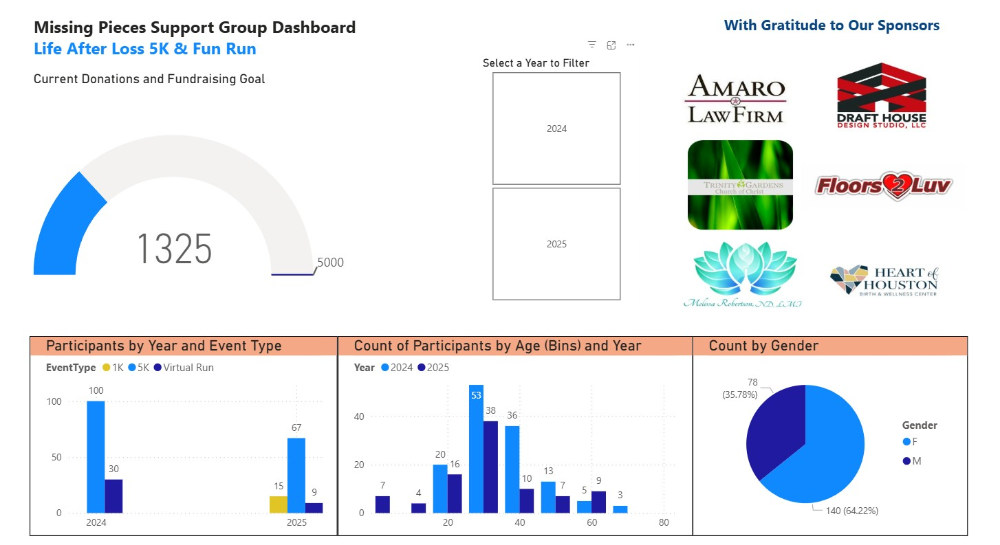

# 💼 Missing Pieces Support Group – Life After Loss 5K & Fun Run & Virtual Challenge Dashboard

## 📌 Project Overview
This project highlights an interactive Power BI dashboard designed for the Missing Pieces Support Group’s Life After Loss 5K & 1K Fun Run & Virtual Challenge. The dashboard brings together participation, fundraising, and sponsorship data into a single view—helping organizers track progress toward goals and share impact with the community.

## 🔎 Key Features
- **Participants by Year and Event Type** – compare registration trends year over year
- **Participant Age Groups** – visualize age distributions across events
- **Participation by Gender** – track inclusivity and engagement
- **Current Donations vs. Fundraising Goal** – monitor progress toward the $5,000 goal
- **Sponsors Recognition** – highlight supporting organizations and individuals (Amaro Law Firm, Draft House Design Studio, LLC, Trinity Gardens Church of Christ, Floors 2 Luv, Melissa Robertson ND LMT, Heart of Houston Birth & Wellness Center)

## 🛠️ Tools & Techniques
- Power BI for data modeling and visualization
- Power Query for data cleaning and transformation
- DAX for calculated measures (Age Groups, Donation Totals, Goal Progress)
- Excel for initial data preparation and exploration
- GitHub for portfolio documentation and sharing

## 🎯 Purpose
The purpose of this project is to demonstrate how fundraising and event data can be transformed into actionable insights using interactive dashboards. This work supports Missing Pieces Support Group’s mission by providing visibility into participation, fundraising progress, and sponsor contributions—all while making the story behind the numbers more accessible.

## 📎 Files Included
- `MPSG_5K_Dashboard.mp4` – Walkthrough video of the dashboard
- `Dashboard.jpg` - image
- `README.md` — Project documentation (this file)

## 📊 Sample Visuals

## 📊 Sample Video Demonstration
▶️ [Watch on YouTube]( https://www.youtube.com/watch?v=P9DBXyVb4L4)

## 🗂️ Project Status

✅ Complete – Ready for demonstration and portfolio inclusion  

## 📫 Contact
Catherine McKillips

[LinkedIn](https://www.linkedin.com/in/catherine-mckillips-data-analytics)  

## 📧 Email
cathymckillips@gmail.com
